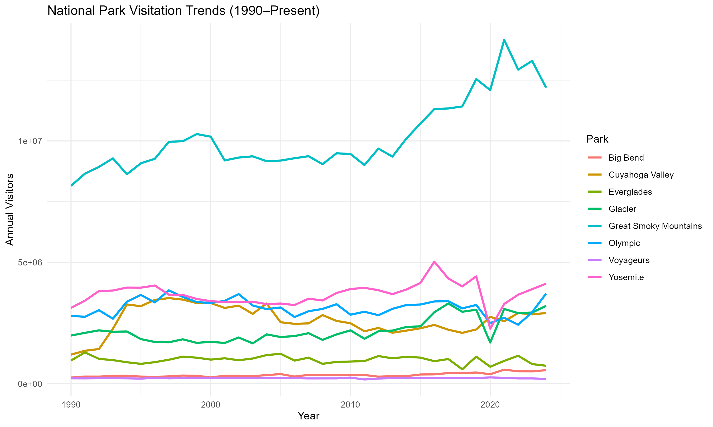
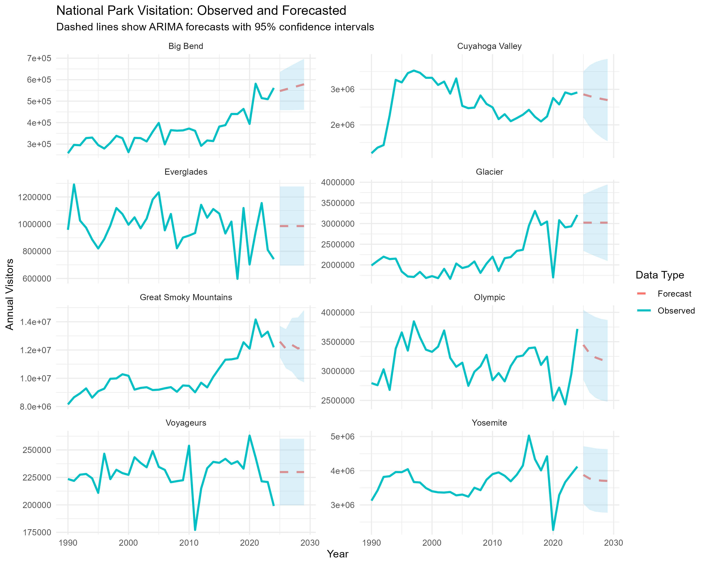

# 🗻 National Parks Attendance Forecasting

## 📊 One Tiny Question
> **How has visitation changed in top U.S. national parks since 1990, and what can we expect over the next five years?**

---

## 🗂 The Dataset

- **Source:** [National Park Service Visitor Use Statistics](https://irma.nps.gov/STATS/)
- **Scope:** Annual attendance data for 8 U.S. national parks, spanning 1990–2023
- **Geographic balance:** Parks were selected across regions to reflect varied access, climate, and ecosystems:

| Region | Parks |
|--------|-------|
| West   | Yosemite, Olympic |
| South  | Big Bend, Everglades |
| North  | Glacier, Voyageurs |
| East   | Great Smoky Mountains, Cuyahoga Valley |

---

## 🔍 My Thought Process

1. **Why this dataset?**  
   I’ve always loved the outdoors, and national parks are a great reflection of how society interacts with nature. I was curious whether COVID impacted long-term visitation and which parks are growing fastest.

2. **What did I want to learn?**  
   Not just trends—but **forecasts**. I wanted to predict future attendance and identify parks that are seeing the most momentum.

3. **Why time series modeling?**  
   Each park has its own unique trend. ARIMA gave me a way to model and forecast those patterns independently while still comparing them side-by-side.

---

## 🧪 The Process

- Downloaded annual visitation CSVs from the NPS IRMA portal
- Cleaned and combined data using `tidyverse`
- Selected data from 1990 onward for consistency
- Created line plots to visualize historic trends
- Used `auto.arima()` from the `forecast` package to model each park individually
- Forecasted the next **5 years** of visitors (2024–2028)
- Combined historical and forecast data into one tidy dataframe
- Created faceted visualizations with 95% forecast confidence intervals

---

## 📈 Key Visualizations

### 🕰️ Historical Visitation Trends

A look at how annual visitation changed from 1990 to 2023 for each of the eight selected parks.

---

### 🔮 Forecasted Attendance (2024–2028)

This chart combines observed and forecasted attendance for each park using ARIMA models, including 95% confidence intervals for the next 5 years.

---

## 🧠 What I Learned

- **Visitor growth is uneven.** Some parks are surging quietly (e.g., Big Bend, Cuyahoga Valley), while others are stable or recovering.
- **COVID's impact was sharp but short-lived.** Most parks returned to pre-pandemic levels by 2022.
- **Forecasting is helpful—even with yearly data.** ARIMA was flexible enough to model regional differences without overcomplicating.
- **Urban vs remote access matters.** Parks near cities tend to recover faster and grow more consistently.

---

📄 [View Full Technical Report (PDF)](miniproject_natl_parks.pdf)

---

## 💬 Next Steps

- Forecast using **monthly** visitation if data is available
- Test seasonal ARIMA or additive decomposition methods
- Integrate external drivers like fuel prices or weather patterns
- Share insights with park planning or tourism departments

---

[← Back to Projects](/projects)
